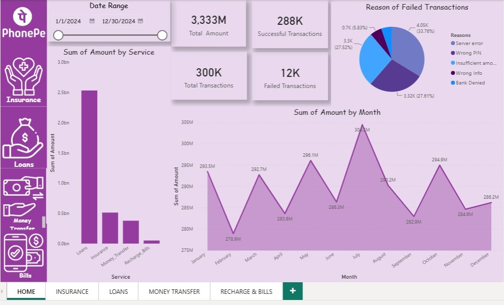

# 📱 PhonePe Digital Payment Analytics

> An end-to-end Business Intelligence project built using **Power BI, Excel, Power Query, and DAX** to analyze digital payment transactions, identify business trends, monitor KPIs, and generate actionable insights.



---

## 📌 Project Overview

This project analyzes **50,000+ PhonePe digital payment transactions** across four major service categories:

- 💰 Loans
- 🛡 Insurance
- 💸 Money Transfer
- 📱 Recharge & Bills

The dashboard helps monitor transaction performance, payment success rates, failure reasons, monthly trends, and service-wise contributions using interactive visualizations.

---

## 🎯 Business Objective

The objective of this project is to transform raw transaction data into meaningful business insights by answering questions such as:

- Which service generates the highest transaction value?
- What are the major reasons for payment failures?
- Which months experience peak transaction volume?
- What is the overall payment success rate?
- Which business areas require operational improvements?

---

## 📊 Dashboard Pages

| Dashboard | Description |
|-----------|-------------|
| 🏠 Home | Overall business performance and KPIs |
| 🛡 Insurance | Insurance transaction analysis |
| 💰 Loans | Loan transaction insights |
| 💸 Money Transfer | Transfer trends and payment analysis |
| 📱 Recharge & Bills | Utility payment performance |

---

## 📈 Key KPIs

- ₹3.33 Billion+ Total Transaction Amount
- 300K Total Transactions
- 288K Successful Transactions
- 12K Failed Transactions
- 96.75% Payment Success Rate
- Monthly Transaction Trend Analysis
- Service-wise Revenue Distribution
- Failure Reason Analysis

---

## 🛠 Tools & Technologies

- Microsoft Power BI
- Microsoft Excel
- Power Query
- DAX
- Data Cleaning
- Data Modeling
- KPI Reporting
- Dashboard Design
- Business Analytics

---

## 📂 Repository Structure

```
PhonePe-Digital-Payment-Analytics
│
├── Dashboard
│   ├── PhonePe Dashboard.png
│   └── PhonePe.pbix
│
├── Dataset
│   └── PhonePe Dataset.xlsx
│
├── Report
│   └── PhonePe-Digital-Payment-Analytics.pdf
│
├── Presentation
│   └── PhonePe-Digital-Payment-Analytics.pptx
│
└── README.md
```

---

## 📥 Project Files

### 📊 Dashboard (.pbix)

➡️ **Download Here**

*(Add your Google Drive link)*

---

### 📁 Dataset (.xlsx)

➡️ **Download Here**

*(Add your Google Drive link)*

---

### 📄 Project Report

Available inside the **Report** folder.

---

### 📽 Presentation

Available inside the **Presentation** folder.

---

## 📊 Dashboard Features

✔ Interactive Filters & Slicers

✔ KPI Cards

✔ Monthly Trend Analysis

✔ Service-wise Performance

✔ Transaction Failure Analysis

✔ Payment Success Rate Monitoring

✔ Business Recommendations

✔ Dynamic Visualizations

---

## 💡 Key Business Insights

- Loans contribute the highest transaction value across all services.
- Overall payment success rate exceeds **96%**, indicating strong platform reliability.
- Most payment failures are caused by incorrect PINs, incorrect payment information, insufficient balance, and server errors.
- July and November record the highest transaction volumes, indicating seasonal demand.
- Service categories contribute consistently to overall platform activity, reflecting balanced customer usage.

---

## 🚀 Future Improvements

- Real-time data integration
- Predictive analytics using Machine Learning
- Customer segmentation
- Fraud detection dashboard
- Drill-through reports
- Mobile optimized dashboard

---

## 👨‍💻 About Me

**Aryan Rai**

Aspiring Data Analyst passionate about Business Intelligence, Data Visualization, SQL, Power BI, Excel, Python, and Analytics.

### Connect with Me

- LinkedIn: https://linkedin.com/in/YOUR-LINKEDIN
- GitHub: https://github.com/YOUR_GITHUB_USERNAME

---

## ⭐ If you found this project useful, consider giving it a Star!
